# Wireshark Network Forensics: Reconstructing a User's Activity from One Packet Capture

I did this project in October 2025 for my network analysis coursework. I was handed a single packet capture (a `.pcap` file, which is a recording of everything that crossed one network for a stretch of time) and a list of fifteen questions about one watched device. The job was to answer every question using only what was in the capture, and to back each answer up with evidence from the packets.

I think the best way to describe it is that I had to reconstruct what a person did on their network without ever seeing their screen. The device, the router, the mail server, the web server, and the FTP server were all in the capture, and a lot of what happened on them was sent in cleartext.

> The `.pcap` file and the assignment belong to the course, so they are not in this repo. As far as I know the capture is built around a fictional person. I still blacked out every password in my screenshots, and I left out two screenshots completely (a tax form and a page full of saved logins), because I would not post real credentials or personal documents publicly and I would rather practice handling them the right way.

## Tools

- **Wireshark** for all of the analysis: display filters, Follow TCP/HTTP Stream, File > Export Objects, and the packet details pane
- **TLS decryption in Wireshark** using the key log file provided with the project, so the encrypted HTTP/2 traffic to DuckDuckGo could be read
- A basic understanding of ICMP, DNS, HTTP, HTTP/2, Telnet, FTP, SMTP, and Ethernet headers

---

## 1. Identifying the devices

**Watched device:** `172.16.27.17`, MAC `7c:f1:7e:3b:39:19` (a TP-Link device)

I filtered on the watched device's IP and read the Ethernet header of any packet it sent. The source MAC is the device's own hardware address, and Wireshark's vendor lookup labels it TP-Link.

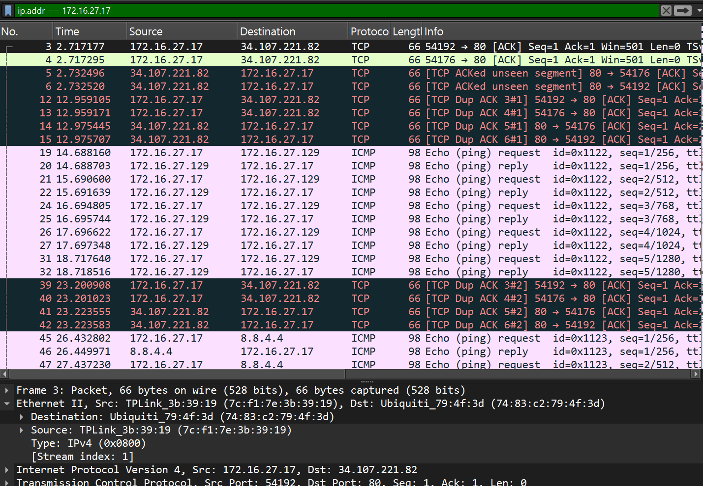

**First device pinged:** `172.16.27.129`

Filtering on `icmp` shows five Echo Requests (pings) from the watched device to `.129`, each answered with a reply, followed by pings to `8.8.4.4` (one of Google's public DNS servers). The first target was `.129`, and I later confirmed that `.129` is the local router.

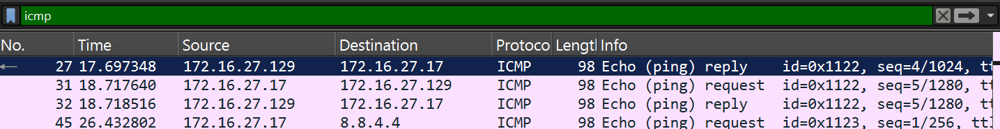

**Gateway MAC:** `74:83:c2:79:4f:3d` (Ubiquiti) 

The gateway is the device a computer hands its traffic to when the destination is outside the local network. In the first screenshot above, the watched device is sending to an outside address (`34.107.221.82`), and the Ethernet destination on that packet is the Ubiquiti device. From my understanding that is the gateway, meaning the next hop for anything leaving the network.

The router at `.129` is a separate device with its own MAC, `ba:db:ee:ff:f9:48`, which shows up in the Ethernet header of its ping reply.

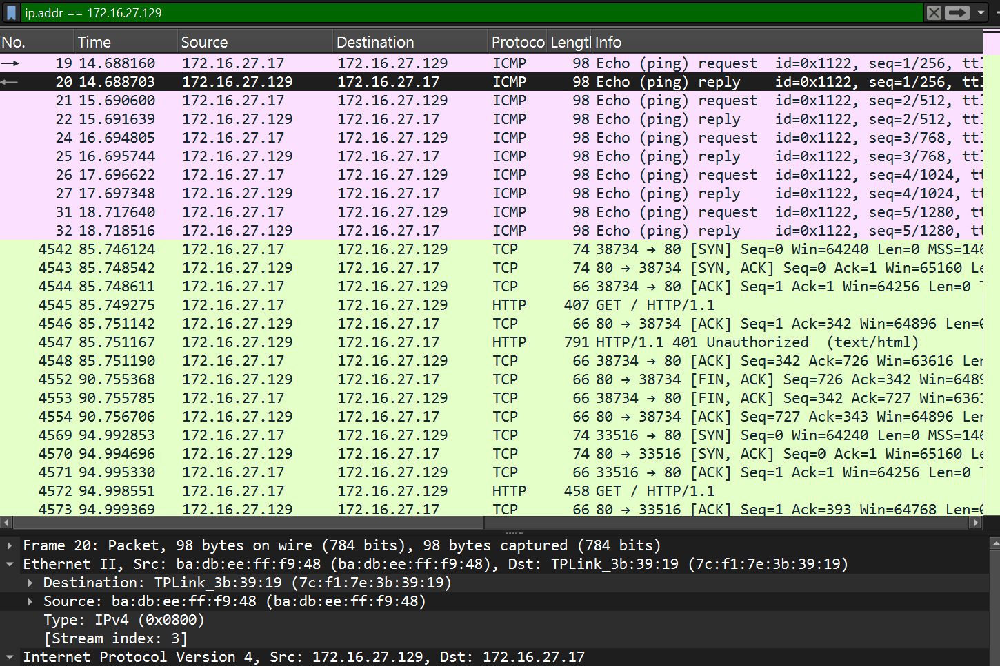

**DNS server:** `172.16.27.1`

Filtering on `dns` shows the watched device sending every name lookup to `.1`.

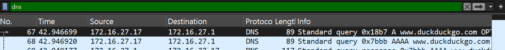

**IP for duckduckgo.com:** `40.89.244.232`

I followed the first DNS conversation (`udp.stream eq 0`) and read the response. `www.duckduckgo.com` comes back as an alias (a CNAME) for `duckduckgo.com`, and the A record (the one that holds the IPv4 address) is `40.89.244.232`. That same address shows up later as the destination of the browser's traffic, which is a nice cross-check.

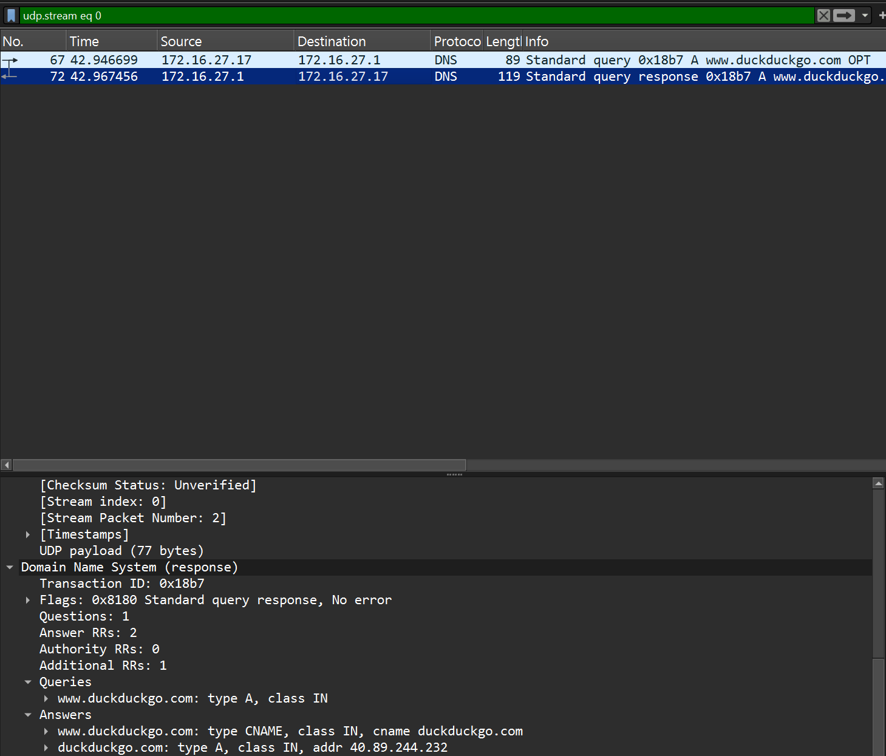

---

## 2. Cleartext logins

Four different services in this capture sent credentials or sensitive content with no encryption at all. Anyone on the network path could have read every one of them.

### Router login over HTTP

**Router:** `172.16.27.129`, **account:** `sstevenson` (password redacted)

I filtered on the router's IP and looked at the HTTP requests. The first `GET /` got a `401 Unauthorized` back, and the next `GET /` carried an `Authorization: Basic ...` header. HTTP Basic authentication is just the username and password joined together and Base64 encoded (a way of writing data as text, not a form of encryption), meaning Wireshark can decode it instantly and shows it in a field labeled Credentials.

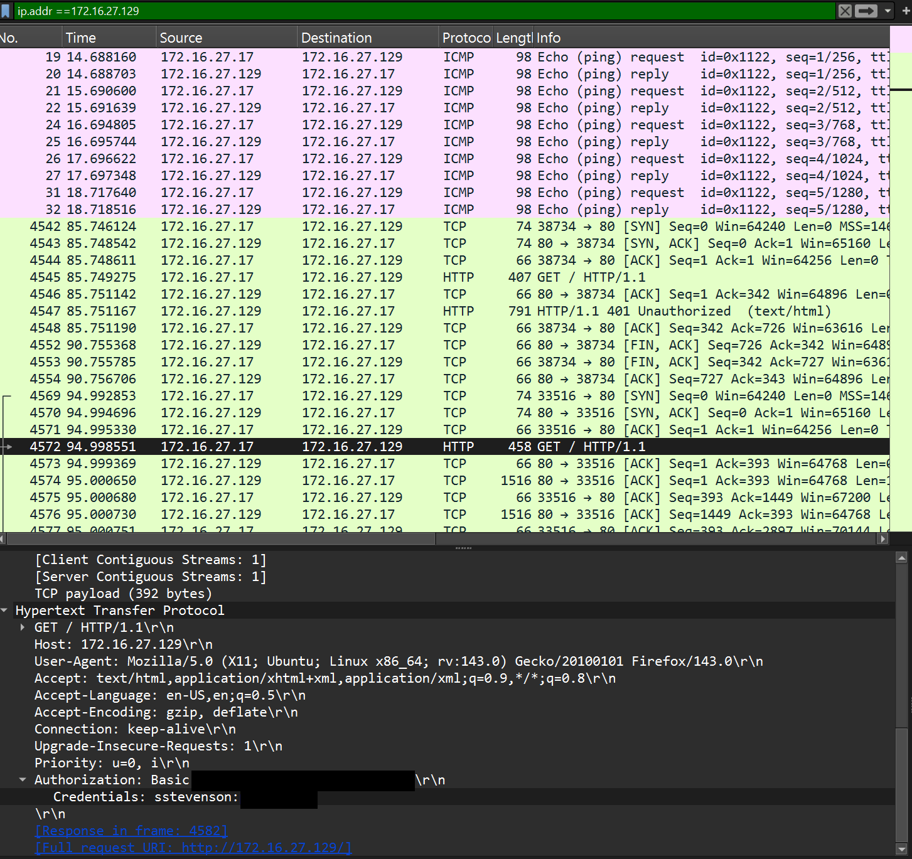

### Mail server login over Telnet

**Mail server:** `172.16.27.225` (`prj-mail.my-infra.org`), **account:** `root` (password redacted)

Filtering on `telnet` and following the TCP stream shows the whole login. Telnet sends every keypress as its own packet, which is why the username is spelled out one letter at a time in the stream view.

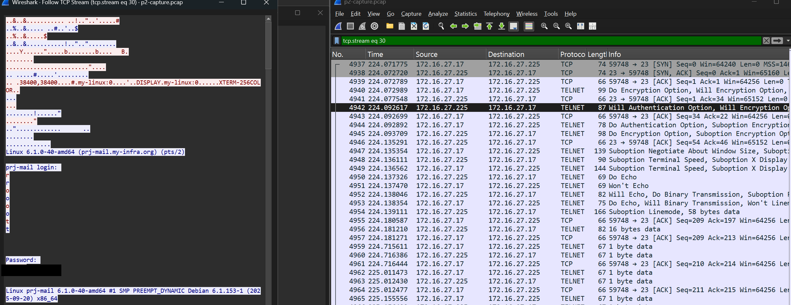

The same stream gave me three more answers:

- **Uptime:** 1 hour 32 minutes (the `uptime` command output read `up 1:32`)
- **Kernel:** `Linux 6.1.0-40-amd64`
- **Full banner:** Debian 6.1.153-1, built 2025-09-20

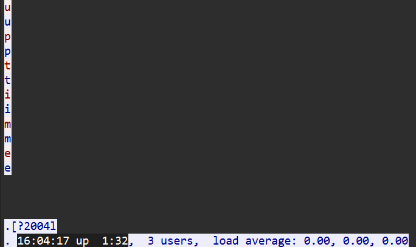

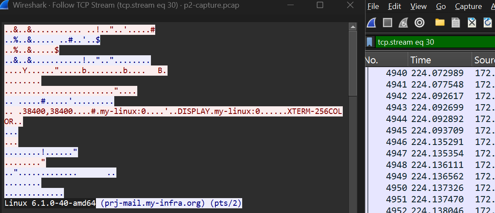

### Editing the mail server's password file

In that same Telnet session, the user went into `/etc/postfix` as root and ran `pico sasl_passwd`. That file holds the logins Postfix (the mail server software) uses to relay mail through other providers. The file ends up with three entries, one each for AOL, ProtonMail, and Gmail, and the line I identified as the addition was the Gmail relay entry (`smtp.gmail.com:587`). `[confirm which of the three lines was the new one]`

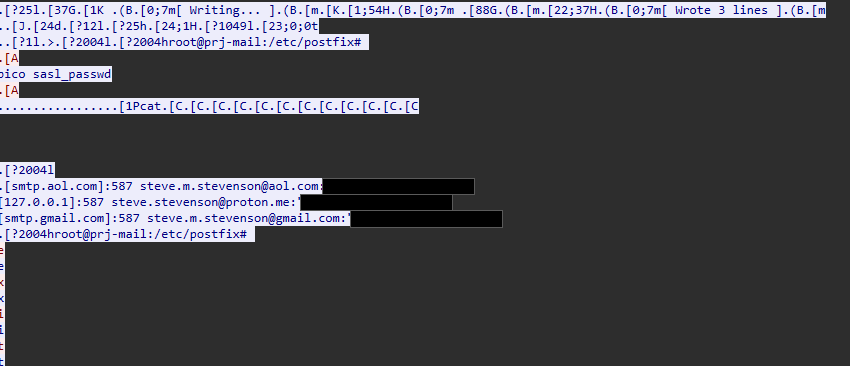

I noticed the same password is used for all three accounts, so one leak exposes all of them.

---

## 3. Email and web activity

### The email

I followed the SMTP stream (`tcp.stream eq 29`) and read the whole conversation. The server announced itself as Postfix and even offered STARTTLS (an upgrade to encrypted mail transfer), but the client never took it, so the message went across in plain text.

- **From:** `steve.m.stevenson@aol.com`
- **To:** `help@security-firm.co.uk`
- **Message:** "I would like to get a quote on your identity protection package." signed "-steve"

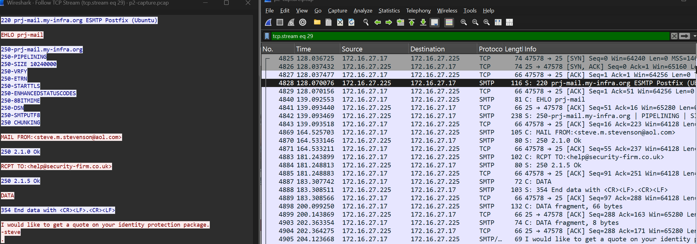

### The web searches

DuckDuckGo traffic is HTTP/2 over TLS, so I needed the key log file to read it. Once the decryption was set up, I filtered with:

```
http2.header.value contains "GET" and !http2.header.value contains "/ac/?q="
```

The `/ac/?q=` requests are the autocomplete suggestions that fire as someone types, so excluding them leaves the finished searches. The first complete search was **"what is quantum cryptography"** (about 72 seconds in), and the second was **"best password manager 2025"**.

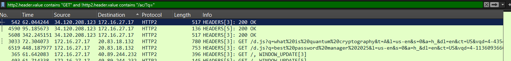

### The local web server

Filtering on the web server (`172.16.27.226`) and following the stream shows the watched device requesting a page called `vault.html`. The page is a plain HTML table listing a location, username, password, and creation date for the router, the mail server, the web server, an AOL account, and a ProtonMail account. The screenshot below only shows the request for it, since a screenshot of the page itself would just be a page of passwords.

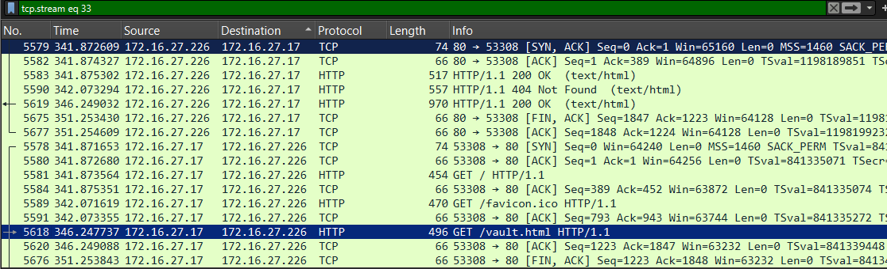

---

## 4. File transfer

**File downloaded over FTP:** `2024-sstevenson-1040.pdf`

The FTP server is the same machine as the web server (`172.16.27.226`). The login (`USER` and `PASS`) crosses the network in cleartext, and then the control channel shows `TYPE I`, `SIZE`, and finally `RETR 2024-sstevenson-1040.pdf` (RETR is the FTP command for downloading a file). The transfer finished with a `226 Transfer complete`.

To get the actual file, I used **File > Export Objects > FTP-DATA** in Wireshark, which rebuilt the 219 kB PDF straight out of the packets. It turned out to be a 2024 IRS Form 1040 tax return. I am leaving that screenshot out of the repo since it is a tax form.

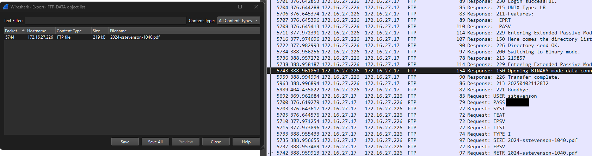

---

## 5. Identifying the router

**Vendor and model:** Linksys E2530 v3

I used **File > Export Objects > HTTP** and looked through what the router at `.129` had served. The `status-data.jsx` files are the router's status page data.

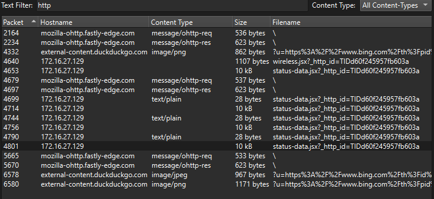

Inside one of them, the router's own `nvram` settings (its stored configuration) list the model name `Linksys E2530 v3` along with the LAN address `172.16.27.129` and its MAC. The router name in that file is `FreshTomato`, which from my understanding is a popular open-source replacement firmware for consumer routers.

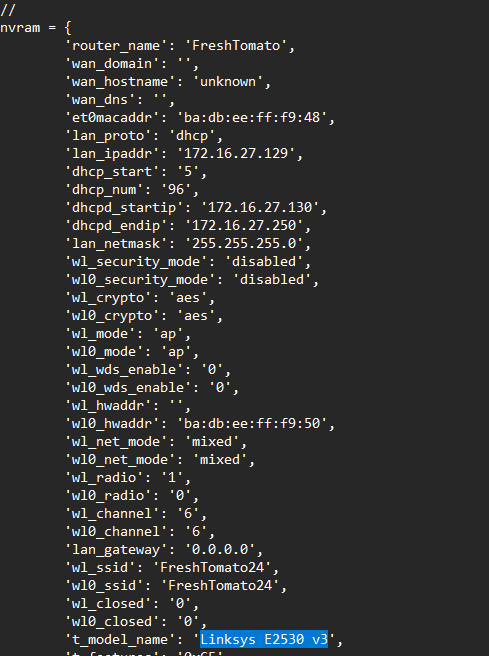

---

## What this capture says about security

I think the capture is a good example of one habit causing most of the damage: using cleartext protocols and reusing passwords. HTTP Basic authentication, Telnet, FTP, and unencrypted SMTP all exposed their contents to anyone watching, and a saved-logins web page and a password-relay file were both sitting in places they could be read. My recommendations would be:

- Replace Telnet with SSH, FTP with SFTP, and plain HTTP with HTTPS
- Require STARTTLS (or TLS) for mail instead of just offering it
- Stop reusing one password across accounts
- Keep passwords out of web pages, and use a password manager instead

## Skills Used

Wireshark display filtering, Follow TCP/HTTP Stream, Export Objects, TLS decryption with a key log file, Ethernet/MAC analysis, protocol analysis (ICMP, DNS, HTTP, HTTP/2, Telnet, FTP, SMTP), cleartext credential identification, evidence documentation, redacting sensitive data, technical writing

## What I Learned

**Filters do most of the work.** A capture with thousands of packets is unreadable until you narrow it, and once I started filtering by IP, protocol, or stream index, each question took a few minutes instead of an hour.

**Follow Stream turns packets into a story.** Looking at one packet at a time tells you very little, but following the TCP stream for the Telnet session or the SMTP conversation lets you read it the way the user experienced it.

**Encoding is not encryption.** The router login looked scrambled in the raw header, but Base64 is not protection, so Wireshark showed the credentials in a field of their own.

**Checking my own work matters.** Rechecking my screenshots while writing this up, I caught a few typos in my original answers (an IP address and a MAC address), which is a good reminder to verify against the evidence before writing anything down.

`[closing line: something honest about which question was hardest or what you'd do differently]`

## Repo Contents

```
.
├── README.md
└── images/
    └── (screenshots used above, with passwords redacted)
```
